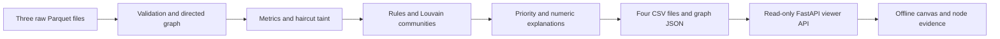

# Money Graph

Offline, explainable analysis of the HackAlem AI financial transaction network.
Implemented milestones: **spec 01 pipeline, spec 03 viewer, spec 03b viewer polish,
and assigned spec 04 findings with spec 04b threshold tuning**.
The offline canvas viewer supports directed exploration, exact identifier search,
role and cluster colours, evidence cards and CSV downloads. No LLM analyst from
other specs is implemented.

## Setup and run

Python 3.11+:

```bash
make install
make pipeline
source .venv/bin/activate
pytest -q
make run
```

Equivalent pipeline command:

```bash
python -m pipeline.run --data data/raw --out out
```

The pipeline works offline after dependency installation. It needs no API key,
external account, GPU or paid service. The three official Parquet files in
`data/raw/` are immutable inputs. Missing/inconsistent data fails explicitly;
there is no synthetic replacement. Exact tested versions are in
`requirements.lock.txt`; allowed ranges are in `requirements.txt`.
Aggregated amounts are compared with an absolute tolerance of 0.000001 KZT
to accommodate binary floating-point summation; transaction counts match exactly.

Docker (only Docker required on the host):

```bash
docker compose up --build
```

Open http://localhost:8000 after `make run`.

The container computes all outputs before starting FastAPI
when outputs are absent/incomplete. The image excludes local `out/` and `.env`,
so a clean image computes results from the supplied raw data. `/api/health`,
`/api/tools` and the analyst viewer are available at localhost:8000. Old example
account tools have been removed. No new deployment is part of this milestone.

## Architecture



The Python package `pipeline/` is independent of the web application. All input
nodes are inserted before edges, including isolated seeds. Identifiers stay
int64 for computations and exact decimal strings in graph JSON, because browser
JavaScript cannot safely represent these approximately 1e17 integers as numbers.

## Outputs and requirement coverage

| File | Contents | Check |
|---|---|---|
| `out/nodes_roles.csv` | gid, role, role_score, cluster_id, priority_score, evidence | Every one of 2,248 nodes exactly once; evidence <=200 chars |
| `out/clusters.csv` | cluster_id, n_nodes, n_seed, sum_kzt_internal, top_gids, hypothesis; additional role/taint counts | Every node belongs to a reported cluster |
| `out/top_nodes.csv` | rank, gid, role, priority_score, why | Top 30, decreasing priority with stable ties |
| `out/metrics.csv` | All calculated features, consolidator-payer/source-cluster counts and peripheral sub-reason | Numerical basis for explanations; tuned coordinator and scatter/gather rules meet spec 04b count targets; boolean findings and evidence |
| `out/extension_requests.csv` | Cut-off nodes with p_continues >=0.5, sorted by taint value then gid | Next export requests; no invented outgoing edges |
| `out/skeleton_edges.csv` | src, dst, sum_kzt from the two-sided hierarchy trace | Drops edges below 1% of recipient inflow |
| `out/blocking_plan.csv` | step, gid, role, cut_share_cumulative for 10 greedy non-seed removals | Deterministic choices; cumulative cut never decreases |
| `out/graph.json` | String identifiers, roles, clusters, directed edges, coordinates and counts | All nodes on an interactive directed canvas |

| Viewer requirement | Implementation | Check |
|---|---|---|
| Directed map, roles and communities | Canvas arrows, role filters/counts, role/cluster colours | Pan, zoom, hover and select |
| Readable default overview | Peripheral filter starts unchecked; 440 role-bearing accounts shown | Enable the filter to inspect all 2,248 accounts; selected accounts remain visible |
| Fit the main network | Initial overview and Overview fit the largest weakly connected component (1,877 accounts) | Other components remain searchable; no nodes are removed |
| Zoom to the selected account | Animated fit of its two-hop neighborhood to 80% of the canvas | Search, top list, canvas and neighbor links share the same selection path; Overview fits back |
| Clean ego view | One hop by default, optional second hop, amount-sorted columns and outer edge labels | Peripheral neighbors remain visible; reciprocal directions are preserved |
| Find any gid and inspect neighbors | Exact string and suffix search, two-hop focus, ego columns | Node card shows amounts, metrics and evidence |
| Investigation priorities and exports | Clickable Top-30 and three CSV downloads | Read-only artifacts; no API key or CDN |
| Explain each role and priority | Pipeline-generated rule trace and weighted score breakdown in the node card | Shows failed preceding rules, actual values, thresholds, bonuses, multipliers and normalization |
| Discover accounts without a gid | Click a role name or a Flagged filter for a priority-ordered account list | Each row shows short gid, priority and first finding; click focuses and zooms |
| Hierarchy skeleton | 174 retained accounts in observed seed-hop rows, seeds below, with 446 exported directed edges | Click keeps the hierarchy visible and opens the account card; Overview exits |
| Explain the method | Header Method modal loads six pipeline steps and ordered rules from /api/method | Thresholds come from pipeline/config.py; works without generated artifacts |

Run `pytest -q tests/test_pipeline.py` to check coverage, schemas, score bounds,
cluster assignments, cut-off handling, runtime and identical CSVs from two runs.
`generated_at` in graph JSON is intentionally the current generation timestamp;
CSV content is deterministic. Pipeline logs report role counts and elapsed time.
The official batch limit is five minutes; automated regression limit is also five minutes, including counterfactual blocking.

## Analyst viewer

Overview fits the largest weakly connected component (1,877 accounts), keeping
other components available by search or pan. The peripheral filter starts off.
Search a full gid or its last digits and press Enter to focus the first match.
Click a node or Top-30 entry to inspect its role hypothesis, priority, community,
metrics and directed incoming/outgoing transfers. Neighbor rows navigate to that
account. Focus highlights two hops; **Ego view** starts with direct neighbors,
payers left and recipients right, sorted by observed transfer amount. **Show 2nd
hop** adds their neighbors. Amount labels sit near column ends; drag vertically
for large columns. Reciprocal neighbors occupy one position on the payer side. Escape returns to overview. Drag to pan and use the wheel to zoom.
Seeds have black rings; hollow nodes mark the depth-4 observation cutoff.

**Why this role** shows the first matching rule and the earlier rules that failed,
using the node's measured values and configured thresholds. **Why this priority**
shows all five weighted contributions, the finding bonus, seed/cut-off discounts,
global normalization and the payout adjustment. These explanations are generated
by the pipeline and exported as structured JSON in `graph.json` and JSON columns
in `metrics.csv`; the browser does not recompute the analysis.

The API serves `/api/graph`, `/api/node/{gid}`, `/api/search?q=...`, `/api/top`,
`/api/clusters` and `/api/download/{name}`. Downloads allow only `nodes_roles.csv`,
`clusters.csv` and `top_nodes.csv`. IDs are strings throughout. Artifacts load at
startup and refresh when file modification times change. Missing or incomplete
artifacts return HTTP 503 with the message "Run `make pipeline` first".
The existing `/api/ask` endpoint retains its original configuration requirements.

Click a role name to list accounts; its checkbox controls map visibility independently.
**Flagged** lists common counterparties, synchronous inflow, scatter/gather, likely
legitimate payouts and extension requests (cut-off with continuation probability
>=0.5). Lists sort by priority descending then gid; selecting a hidden account
reveals it. `/api/accounts?role=...` or `/api/accounts?flag=...` serves these lists.
Exactly one supported filter is required; invalid filters return HTTP 400.

**Hierarchy skeleton** shows the pipeline-retained network, including peripheral
seeds even while their normal overview filter is off. Rows follow observed shortest
seed-hop levels, with seeds below; they are not proven organizational ranks.
`/api/skeleton` serves the exact retained edges from `skeleton_edges.csv`.

**Method** opens the six pipeline steps and first-match role table, served from
`pipeline/config.py` through `/api/method`. Close or Escape returns to the selected
account without changing the graph. No role thresholds are duplicated in JS.

## Role rules

<!-- ROLE_RULES_START -->
| Role | First-matching rule |
| --- | --- |
| Coordinator | Non-seed; receives from >=3 consolidator candidates (in-degree >=5); betweenness breaks score ties |
| Consolidator | In-degree >= 5 |
| Distributor | Out-degree >= 10 and >= 2 x in-degree (minimum denominator 1) |
| Transit | Non-seed; in/out-degree >= 1; observed out/in ratio 0.8-1.2 |
| Terminal | Depth <= 3; incoming > 0; zero outgoing or non-seed out/in < 0.2; in-degree >= 2 or incoming >= 300,000 KZT |
| Peripheral | Everything else; cut-off, one-off, isolated seed, or other sub-reason |
<!-- ROLE_RULES_END -->

Rules are applied in the listed order: the first match wins, as required by
spec 01. Scores measure heuristic support, not calibrated probabilities or guilt.
Seed accounts are excluded from ratio-based transit classification. Their terminal
classification can use observed zero outflow, but never an understated inflow ratio.
Every conclusion is an investigation hypothesis about the observed network.

## Metrics, tracing and ranking

Metrics include distinct payers/recipients, observed amounts and transaction
counts, directly paying seeds, distinct seed sources within two directed hops,
weighted PageRank and exact unweighted directed betweenness. PageRank uses NumPy
power iteration, avoiding a SciPy dependency.

Haircut tracing fixes each seed's outgoing share to 1. Other nodes receive the
sum of upstream amounts times upstream shares, then divide by the larger of their
observed inflow and outflow (capped at 1). This dilutes the attributed share where
outflow exceeds observed inflow. Synchronous iterations stop below 1 KZT change or
at 20 passes. This is an attribution model, not proof of the origin of each transfer;
cyclic graphs can retain uncertainty and sums across nodes are not unique money.

Priority combines percentile ranks of attributed inflow (0.30), two-hop seed
sources (0.20), PageRank (0.15), betweenness (0.15), and role weight (0.20).
Seed scores are multiplied by 0.6; depth-cut-off scores by 0.7, then all scores
are normalized by the maximum. These are specified review priorities, not guilt
probabilities. Each top entry names its two strongest weighted components.

`fast_pass_share` is the fraction of outgoing amount whose transaction date is
0-2 days after **any** incoming transfer, exactly as spec 01 defines it. It does
not match monetary lots, establish provenance, or prove that the same money moved.

## Communities and graph coordinates

Louvain deliberately uses an undirected projection to group accounts that trade
with one another; reciprocal directed amounts are summed. Direction remains intact
for role metrics and exports. Louvain seed is 42 and resolution is 1.0. Isolates
receive individual clusters, numbered by descending size with stable tie-breaking.
Graph coordinates use a seeded, unweighted spring layout with 100 iterations,
scaled to [-1000,1000].
Without SciPy, NetworkX's dense NumPy Fruchterman-Reingold implementation is used
because its public layout switches to a SciPy-backed path for this graph size.
The specified seed, unweighted forces and iteration count are preserved; the
private fallback is covered by the pinned NetworkX version and end-to-end tests.

## Limits and interpretation

- Depth-4 zero-outflow nodes are censored by traversal and are not assigned terminal.
- Earlier zero-outflow nodes are stops **in this observed dataset**, not proven final recipients.
- Only July 2026, intra-bank transfers >=5,000 KZT are observed. Inflows are incomplete,
  particularly for seeds; net observed flow is not an account balance.
- High outflow/inflow alone is not evidence of wrongdoing. No identities, missing
  transactions or customer attributes are inferred from external sources.
- No ground-truth roles exist. The thresholds and ranking are transparent hypotheses.
- Analyst chat and other unassigned specs are not implemented. The retained ask
  endpoint has no case-analysis tools.
- Dense ego neighborhoods can overlap; pan/zoom and neighbor tables help inspection.
  The full canvas is designed for this dataset, not a million-node browser view.

## Scale to one million nodes

Replace in-memory pandas/NetworkX passes with partitioned columnar processing and
an efficient graph engine; use sampled rather than exact betweenness. Preserve
fixed seeds and documented role rules. Serve precomputed communities and bounded
neighborhoods instead of laying out or transferring the entire graph to a browser.
Measure any alternative clustering method before changing the interpretation.

## Verification and provenance

`bash scripts/verify_all.sh --no-docker` checks the pipeline, tests, language,
clean-copy behavior and HTTP service. The full command additionally builds and
starts Docker, checks generated artifacts and secret exclusion, and rejects missing
raw data. These checks make no external LLM calls.

See `DISCLOSURE.md` for the pre-built scaffold. Official task/context and the
implemented specifications are `docs/specs/00_CONTEXT.md`, `01_PIPELINE.md` and
`03_VIEWER.md`.
The next session should read `docs/STATE.md` for verified status and scope boundaries.

Coordinator roles use two passes: consolidator candidates meet the in-degree rule before coordinator precedence is applied. Source clusters do not qualify a coordinator. Clusters are assigned before roles; cluster summaries use final roles and priorities.


Findings add 0.05 each (capped at 0.15) to raw priority before seed/cut-off
multipliers and normalization: direct inflow from >=2 seeds, >=3 distinct payers
on one calendar date, fast-pass share >=0.8 with outgoing >=100,000 KZT, and
scatter/gather. The latter requires simple paths of 2-3 hops from the same source
through at least three distinct first intermediaries, with every branch edge
>=50,000 KZT; cycles and a lone chain do not qualify. Each fired finding is explained in metrics and top-node reasons.
Fast-pass is timing correlation, not proof that the same money was forwarded.

After spec 04b tuning, roles are coordinator 29, consolidator 38, distributor 42,
transit 67, terminal 264 and peripheral 1,808. Finding counts are
common_counterparty 24, synchronous_inflow 38, fast_pass 89, scatter_gather 25,
likely_legit_payouts 2 and seed_hub 9. Two consolidator payers produced 94
coordinators, so the configured threshold is three. The 50,000 KZT branch floor
already meets the scatter/gather target; no increase to 100,000 was needed.
The refreshed pipeline completed in 42.20 seconds on the development machine.
These thresholds were tuned on this dataset, without ground-truth labels.


Hop-4 continuation estimates use only depth 1-3 nodes, where outgoing transfers
were traced. Empirical forwarding rates are grouped by in-degree (1, 2, 3-4, 5+)
and incoming-value quartiles learned from that visible subset. Tied quartile
boundaries collapse; empty cells use the overall visible-node forwarding rate.
Only truncated nodes receive p_continues; without training data it stays unknown.
These are observed peer frequencies, not validated individual predictions.


The hierarchy skeleton intersects forward traces from seeds (up to four hops,
positive taint, with seeds retained as origins) and backward traces from the top
taint quartile of coordinator/consolidator candidates (up to four hops).
Only intersecting edges carrying at least 1% of their recipient's observed inflow
survive, reducing incidental small payments. Skeleton membership means an endpoint
of a retained edge. Levels are shortest forward seed-hop distances (seed = 0);
cycles can produce same-level or backward edges, so levels are observational
distance, not a proven organizational rank. Nonmembers have level -1.
CSV edges and graph JSON skeleton/level fields are exported and used by the
Hierarchy skeleton view.


The likely_legit_payouts flag requires out-degree >=10, at least half of outgoing
transactions on the two busiest calendar dates, population coefficient of
variation of outgoing amounts <=0.5, and taint_share <0.2. All conditions must
hold. It halves the normalized priority score without changing the role.
The evidence asks the analyst to verify possible salary/business payouts before
escalating; this is a pattern hypothesis, not a confirmed legitimate business.


Known seeds with in-degree >=5 or out-degree >=20 receive a seed_hub flag and an
evidence suffix noting that the case may reach above street level. This changes
neither their role nor their priority score.


Blocking impact is a counterfactual calculation, not an account-blocking action.
At each of ten steps it removes the non-seed whose removal reduces taint reaching
other remaining accounts the most, with priority then gid breaking ties.
The haircut model retains original incoming/outgoing denominators and uses 20
synchronous passes for every scenario, so missing edges cannot inflate the
remaining accounts' shares. All candidates are considered; if that search
exceeds 60 seconds, it restarts with the top 100 by priority. The cumulative cut
compares total remaining node taint with the original total, including prevented
inflow to removed accounts. This is observed transfer exposure across multiple
hops, not unique currency, a prediction of real-world interdiction, or proof of guilt.

Development potential: an analyst could mark alerts as confirmed or false
positive, for example "legit business." As those labels accumulate, thresholds
and priority weights could be re-tuned and evaluated on held-out labels. Later,
a supervised model could replace the fixed weights. This feedback loop is a
future direction only; no labeling or model-training functionality is implemented.

Blocking these 10 accounts would cut 14.3% of case money flow in the observed graph.
