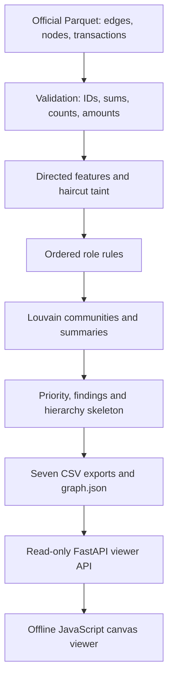

# Money Graph

Which of the **2,248 accounts** should an analyst review first, and why?
Money Graph turns the organiser's transaction graph into reproducible role hypotheses,
ranked evidence and a directed viewer. These are investigation leads, never findings of guilt.

[Live demo](https://kairos-astana.fly.dev) — public viewer, no login or API key required.

## Quick start

From the repository root, with Docker Engine and Compose available:

```bash
docker compose up --build
```

Open [localhost:8000](http://localhost:8000) after the pipeline finishes and the
server starts. Keep port 8000 free; run Docker or Python, not both at once.
The image installs locked dependencies and computes outputs from official inputs.
If any of the eight output artifacts is missing or empty, startup regenerates the
complete set. Health checks allow up to five minutes for the initial computation.
No `.env`, API key, personal account or GPU is required. Building/installing needs
internet access; analysis and the viewer work offline afterward, with no CDN.

Alternatively, with Python 3.11+ and Make installed:

```bash
make install && make pipeline && make run
```

The virtual environment is selected automatically. Stop the foreground server
with Ctrl+C. The measured local pipeline runtime is **45.79 seconds** for
2,248 nodes, 3,119 directed edges and 4,840 transactions (including layout and
counterfactual analysis). Hardware affects runtime; the acceptance limit is five
minutes. Exact dependencies: [requirements.lock.txt](requirements.lock.txt);
allowed ranges: [requirements.txt](requirements.txt).
Remote clean-clone verification passed for Docker/Python without a key; results
and environment details are recorded in [docs/STATE.md](docs/STATE.md).

## How to verify the main scenario

Five steps, about five minutes once dependencies are installed:

1. **Run the computation.** The Docker quick start runs it at first container
   startup. For the Python path, `make pipeline` regenerates all outputs. Watch
   the elapsed-time and role-count log; this is a live computation from Parquet.
2. **Count the three required CSVs.** With Docker running:

   ```bash
   docker compose exec -T app python -c 'import csv; print({f: sum(1 for _ in csv.DictReader(open("out/"+f+".csv"))) for f in ("nodes_roles", "clusters", "top_nodes")})'
   ```

   Expected: `nodes_roles: 2248`, `clusters: 88`, `top_nodes: 30` (at least 20).
   With Python, the same check is:

   ```bash
   .venv/bin/python -c 'import csv; print({f: sum(1 for _ in csv.DictReader(open("out/"+f+".csv"))) for f in ("nodes_roles", "clusters", "top_nodes")})'
   ```

3. **Open the viewer** at [localhost:8000](http://localhost:8000). The Top 30
   priorities list and directed map load. Peripheral accounts start hidden;
   all accounts remain searchable. Download the three CSVs from **Exports**.
4. **Find the top account.** Click the first **Top 30 priorities** entry, copy the
   last six digits of its full gid from the node card, paste them into **Find an
   account**, and click **Find**. Search orders matches by priority then gid, so
   the top account is first even if that suffix is shared.
5. **Explain 2-3 accounts.** Click **Ego view**: payers are left, recipients right;
   reciprocal peers appear once on the payer side with both arrows retained.
   Inspect **Why this role**, **Why this priority**, amounts and evidence. Then
   select another role via its name in the sidebar, and one hollow hop-4 account
   via **Extension requests** under **Flagged**. Explain the measured rule and
   uncertainty for each. **Hierarchy skeleton** shows the retained flow paths;
   **Overview** returns to the main network. **Method** displays configured rules.

## Solution diagram



The diagram shows conceptual stages. Community membership is computed before
role assignment so source-community metrics are available; summaries follow
ranking. [docs/diagram.md](docs/diagram.md) contains the same diagram.

## Role rules and thresholds

**Rule precedence matters: the first matching rule wins.** Execution order is
coordinator, consolidator, distributor, transit, terminal, peripheral. The table
and viewer legend use hierarchy order (transit above distributor), which does
not change rule precedence. This table is generated from
[pipeline/config.py](pipeline/config.py) and measured export evidence. Degree
counts distinct counterparties. Amounts are observed July totals in KZT.

| Role | Rule | Threshold | Example evidence from this run |
|---|---|---|---|
| coordinator | Non-seed; receives from >= 3 consolidator candidates (in-degree >= 5); betweenness breaks score ties | >= 3 candidate payers; candidate in-degree >= 5 | Signs of coordination: receives from 4 consolidator candidates (...5100, ...3100, ...0100), 393K KZT in. |
| consolidator | In-degree >= 5 | >= 5 payers | Signs of consolidation: receives from 5 payers (3 seeds within 2 hops), 985K KZT in, forwards 2336%. |
| transit | Non-seed; in/out-degree >= 1; observed out/in ratio 0.8-1.2 | 0.8-1.2 out/in | Pass-through hypothesis: forwards 100% of 90K KZT received; 44% forwarded within 2 days. |
| distributor | Out-degree >= 10 and >= 2 x in-degree (minimum denominator 1) | >= 10 recipients; >= 2 x max(payers, 1) | Fan-out hypothesis: sends 426K KZT to 15 recipients after receiving from 1 payers. |
| terminal | Depth <= 3; incoming > 0; zero outgoing or non-seed out/in < 0.2; in-degree >= 2 or incoming >= 300,000 KZT | depth <= 3; out/in < 0.2 or no outgoing; >= 2 payers or >= 300,000 KZT | Possible holding point: receives 110K KZT from 3 payers; observed onward flow is 15%. |
| peripheral | Everything else; cut-off, one-off, isolated seed, or other sub-reason | Fallback after all earlier rules fail | Outgoing not observed (cut-off at hop 4); similar visible nodes forward money in 30% of cases - extend the export from this account. |

Role scores in [0,1] express heuristic support for the matched rule, not a
calibrated probability. The node card shows failed earlier predicates through
the matching rule. The complete scoring implementation is
[pipeline/roles.py](pipeline/roles.py). Supplied-data counts: **29 coordinators,
38 consolidators, 42 distributors, 67 transit, 264 terminal, 1,808 peripheral**.
No LLM assigns pipeline roles or rankings; viewer-card explanations are generated deterministically.

## How data caveats are handled

| Data caveat | Handling |
|---|---|
| Hop-4 outgoing transfers were not traced | All 444 affected nodes are marked truncated and excluded from terminal rules. Earlier inflow-based roles can still match; otherwise they are peripheral. `p_continues` estimates continuation from similar depth-1..3 nodes; values >=0.5 enter extension requests. No outgoing edges are invented. |
| Seed inflow is understated | Seeds cannot match transit or the nonzero-outflow terminal ratio rule. Their priority is discounted; observed ratios are retained as metrics, not trusted as seed role evidence. |
| Only outgoing flows were traced | Incoming totals are incomplete. Net observed flow is not a balance; out/in >1 alone is not suspicious. |
| Transfers below 5,000 KZT are missing | Findings describe only the supplied thresholded graph, not complete account activity. |
| Orphan seeds | All input nodes enter the graph before edges. The 19 isolates remain in roles, metrics and singleton communities. |
| 16 connected fragments in the brief | Measured graph has 16 components containing edges plus 19 isolates: 35 weak components total. No fragments are silently dropped; overview fits the largest (1,877 nodes). |
| No customer attributes | No names, identities, occupations or external enrichment are inferred. |
| No ground-truth roles | Rules and clusters are reviewable hypotheses. There is no claimed classification accuracy. |

Validation rejects invalid/duplicate identifiers, unknown endpoints, invalid
amounts and inconsistent transaction aggregates. Aggregate sums allow 0.000001
KZT absolute floating-point tolerance; counts must match exactly.

## Priority, findings and hierarchy

Let `pct(x)` be the average-rank percentile `(rank - 1) / (n - 1)`:

```text
base = 0.30*pct(taint_kzt) + 0.20*pct(seed_sources_2hop)
     + 0.15*pct(pagerank) + 0.15*pct(betweenness) + 0.20*role_weight
raw = (base + min(0.05*number_of_core_findings, 0.15))
      * (0.6 if seed else 1) * (0.7 if truncated else 1)
priority = raw / max(raw) * (0.5 if likely_legit_payouts else 1)
```

If the maximum is zero, priorities are zero. Role weights are coordinator 1.0,
consolidator 0.9, distributor 0.7, transit 0.6, terminal 0.4, peripheral 0.1.
Ties sort by ascending exact gid. Scores rank review effort, not guilt.

**Haircut taint** starts seed shares at 1. Each account receives the sum of
incoming amounts times sender shares, then divides by the larger of observed
inflow/outflow, capped at 1. Seed shares stay fixed. Stop after 20 passes or
maximum change below 1 KZT. This discounts visible dilution but cannot identify
individual units of money. PageRank uses directed amount weights; betweenness
uses unweighted directed paths, never transfer amounts as path distances.

| Finding | Implemented criterion | Accounts |
|---|---|---:|
| Common counterparty | Receives directly from >=2 seeds | 24 |
| Synchronous inflow | >=3 distinct payers on one date | 38 |
| Fast pass | >=80% of outgoing value occurs within 2 days after some incoming transfer; >=100,000 KZT outgoing | 89 |
| Scatter/gather | >=3 distinct first intermediaries on simple 2-3-hop paths from one source; every edge >=50,000 KZT | 25 |
| Possible regular payouts | >=10 recipients, >=50% of outgoing transaction count on the busiest 2 dates, amount CV <=0.5, taint share <0.2 | 2 |
| Seed hub | Seed with >=5 payers or >=20 recipients | 9 |

Only the first four findings add the capped priority bonus. Payout resemblance
halves priority after normalization; it does not establish legitimacy.

**Continuation** uses observed depth-1..3 accounts grouped by incoming-amount
quartiles and payer-count bins (boundaries 2, 3, 5). Each bin's fraction with
outgoing edges estimates `p_continues`; empty bins use the visible population
mean. This produces 10 extension requests, not new transfer records.

**Hierarchy skeleton:** trace forward up to four hops from seeds and backward
up to four hops from coordinators/consolidators in their top taint quartile.
Keep the intersection with positive taint (or seeds), then retain edges worth
at least 1% of recipient inflow. The result has **174 accounts and 446 edges**.
Rows show shortest observed seed-hop distance, with seeds below. Cycles remain;
these rows do not prove organizational authority.

**Blocking plan** is an offline counterfactual only. Ten greedy non-seed removals
maximize marginal reduction at surviving accounts using fixed haircut
denominators and 20 passes. The supplied run cuts **14.3094% of modeled
repeated-hop exposure**, not unique currency. It never blocks an actual account.
A 60-second search budget triggers a restart over the top 100 priority candidates.

## Outputs and requirement coverage

All artifacts are written to `out/`; the three required CSVs also download from
the viewer. Gids are exact decimal strings in JSON and must be imported as text
in spreadsheets (ordinary numeric cells can lose precision).

| Artifact | Schema / contents | Requirement verified |
|---|---|---|
| `nodes_roles.csv` | `gid, role, role_score, cluster_id, priority_score, evidence` | Exactly 2,248 unique nodes, finite scores in [0,1], evidence <=200 characters |
| `clusters.csv` | `cluster_id, n_nodes, n_seed, sum_kzt_internal, top_gids, hypothesis, n_consolidator, n_distributor, n_transit, taint_kzt` | All nodes assigned; 88 explained communities; top gids separated by semicolons |
| `top_nodes.csv` | `rank, gid, role, priority_score, why` | 30 unique accounts, descending priority, deterministic gid ties |
| `metrics.csv` | Per-node flow, degree, centrality, timing, findings, continuation, skeleton and score metrics; JSON `role_explanation` and `priority_explanation` columns | Reproducible numerical basis for every node card |
| `extension_requests.csv` | `gid, p_continues, taint_kzt, in_deg, in_kzt, evidence` | Cut-off accounts meeting the continuation threshold |
| `skeleton_edges.csv` | `src, dst, sum_kzt` | Exact retained directed edges shown by the hierarchy viewer |
| `blocking_plan.csv` | `step, gid, role, cut_share_cumulative` | Ten simulated removals with monotone cumulative cut |
| Clickable graph and layered ego | Separate circles at inspection zoom; directional 1–4 hop columns, 25 accounts per column | Far-out overlap allowed; highest priority wins clicks; omitted branches are counted |
| Hierarchy legend | Coordinator, consolidator, transit, distributor, terminal, peripheral; money-flow hint | Display order follows the chain; role rules and CSV values are unchanged |
| `graph.json` | `nodes, edges, roles_count, generated_at`; coordinates, exact IDs, role/priority explanations | Offline directed map, role/cluster colours, full/suffix search, node details and neighbors |

Louvain uses an undirected projection that **sums both directional amounts**,
resolution 1.0 and seed 42. Isolates get their own communities; IDs sort by
community size then minimum gid. CSVs reproduce identically with the tested
versions; JSON's `generated_at` intentionally changes. Clusters are not labels
of criminal groups. Source datasets remain immutable.

## Architecture and technologies

| Folder | Responsibility |
|---|---|
| `pipeline/` | Independent batch validation, features, rules, taint, communities, findings and exports |
| `app/` | FastAPI, artifact-backed read-only viewer endpoints, errors and logging; experimental assistant with five read-only graph tools |
| `static/` | Vanilla JavaScript Canvas, HTML and CSS; no build step or CDN |
| `tests/` | Pipeline, findings, explainability, API and regression checks |
| `data/raw/` | Three committed organiser Parquet inputs |
| `out/` | Computed artifacts; Docker excludes these from its build context and recomputes them |

Python 3.11 in Docker; pandas, PyArrow, NetworkX and NumPy for analysis;
FastAPI/Uvicorn for HTTP; Docker Compose for local startup; Fly.io configuration
for the public deployment. Fly is configured with a 1 GiB machine for computation plus VM
overhead; 512 MiB failed during deployment. No database, GPU, learned model or
paid analysis API.

| Environment parameter | Default / effect |
|---|---|
| `PORT` | Startup currently uses fixed port 8000; setting `PORT` alone has no effect |
| `APP_NAME` | `kairos`; health response label |
| `APP_ENV` | `local` in Python, `docker` in Compose; health response label |
| `LOG_LEVEL` | `INFO`; server logging |
| `RATE_LIMIT_PER_MINUTE` | `0` locally; applies only to the experimental `/api/ask` endpoint, not viewer reads |
| `TRUST_PROXY_HEADERS` | `false` locally; caller identification for the assistant endpoint |
| `CLIENT_IP_HEADER` | Empty locally; `fly-client-ip` in Fly configuration |

No environment setup is needed for the main scenario. The optional assistant uses the provider, model and key settings in `.env.example`;
the pipeline and viewer remain key-free.

## Inspecting graph neighborhoods

Select an account to fit its two-hop neighborhood. From that fitted zoom inward,
circles stay separate and retain their screen size; far-out overlap is allowed.
The highest-priority account is drawn on top and wins clicks on overlapping
circles. Edge labels that would cover a circle are omitted.

**Ego view** offers 1, 2, 3 or 4 directional hops: payers to the left,
recipients to the right, one column per hop. Each column retains the 25 largest
observed flows from the previous displayed column and marks omitted accounts
with `+N more`. Shared accounts appear once (nearest displayed hop; payer side
wins ties). Parent barycentres determine ordering, with spacing to keep circles
clickable. Pan vertically through tall columns; omitted branches are not expanded.
The hierarchy skeleton wraps wide levels into sub-rows. Overview restores the
full layout.

## Analyst assistant (experimental)

A natural-language entry point at `/assistant.html` (link back to the viewer in its header). It is a foundation for
further development, **not a finished or fully evaluated feature**; the core pipeline, roles, exports and viewer do not
depend on it.

- Five read-only tools compute and retrieve facts from the same pipeline outputs the viewer uses
  (`app/tools/graph.py`): `get_account` (full card, accepts the last digits of a gid), `top_accounts` (optionally by role),
  `who_collects_from` (accounts downstream of at least two given accounts), `money_paths` (directed paths up to 4 hops with
  amounts) and `cluster_summary`. The answer view exposes the tool-call trace, including when no tool was called.
- Requires `LLM_API_KEY` in `.env` (see `.env.example`); without a key the page says so and everything else keeps working.
  The public demo runs without a key, so the assistant is available only locally.
- Known limitations: answers depend on the model choosing the right tool sequence (it sometimes needs a second call after a
  tool returns a hint); no evaluation set yet; English and Russian questions were tried manually only.
- Tests: `tests/test_graph_tools.py` checks the tools deterministically without a key.


## Limitations

- No ground truth; thresholds were tuned on this one dataset, not validated on
  independent cases. Role scores and priorities are not probabilities of guilt.
- Incoming flows and hop-4 outgoing flows are incomplete; the continuation
  estimate is statistical and may not generalize to a deeper export.
- Payout flags describe a pattern, not a legality check. Fast-pass timing is
  correlation, not matched money. Same-day transactions have no intraday order.
- Taint and counterfactual cuts can count exposure along several hops; they do
  not estimate unique illicit currency or predict a real intervention.
- The graph is July 2026 only, excludes transfers below 5,000 KZT, and contains
  no identity attributes or external evidence.
- The viewer and dense layout are built for this supplied graph. Very large ego
  networks need vertical pan; million-node scalability is a design direction.
- Dependency installation and Docker builds need internet; runtime analysis does
  not. The experimental assistant needs a configured model and key;
  no automatic enforcement action is shipped.

## Scaling to approximately one million nodes

This scale has **not** been benchmarked. Replace Python-object graph storage with
igraph/graph-tool or distributed Spark GraphFrames; evaluate Leiden instead of
Louvain. Use approximate/sampled betweenness and sparse-matrix taint iterations.
Recompute changed neighborhoods incrementally each day. Serve precomputed
layouts/tiles and show skeleton plus ego networks only, never all nodes at once.
The current dense force layout must be replaced before attempting that scale.

## Development potential

Collect analyst confirmations and false positives, retune thresholds, then train
and evaluate a supervised model only when reliable labels exist. Evaluate the experimental assistant's tool selection and evidence citations before operational use. Multi-bank data could
reduce missing-flow uncertainty, subject to authorized access and matching.
These are future directions, not implemented capabilities.

## Tests and provenance

After the Python installation, activate the environment and run:

```bash
source .venv/bin/activate
pytest -q
```

The suite checks official-data coverage and CSV determinism across two pipeline
runs, score bounds, role precedence, cut-off handling, isolates, findings,
continuation, skeleton pruning, counterfactual monotonicity, explanation parity,
exact-ID APIs, input errors and the language/secret guards. The pipeline regression
allows five minutes per run. HTTP smoke checks exercise the running viewer.

The generic pre-built scaffold was imported in **H1, commit `b92291c`**.
All case-specific analysis and the graph viewer were built during the event.
See [DISCLOSURE.md](DISCLOSURE.md) for provenance, AI tools and library licences.
