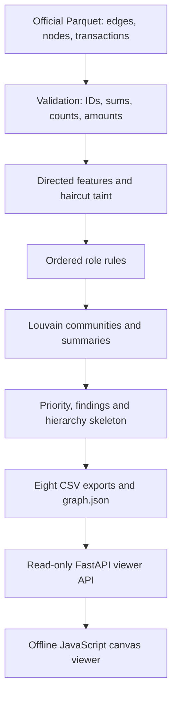

# Money Graph solution diagram

```mermaid
flowchart TD
  P["Official Parquet: edges, nodes, transactions"] --> V["Validation: IDs, sums, counts, amounts"]
  V --> M["Directed features and haircut taint"]
  M --> R["Ordered role rules"]
  R --> C["Louvain communities and summaries"]
  C --> F["Priority, findings and hierarchy skeleton"]
  F --> O["Eight CSV exports and graph.json"]
  O --> A["Read-only FastAPI viewer API"]
  A --> U["Offline JavaScript canvas viewer"]
```

Conceptual stages; community membership is computed before role assignment,
with community summaries finalized after ranking.
